<p align="center">
  
</p>

# StockFlow

StockFlow is an Android inventory and business management app built for small retail businesses in South Africa. Shop owners can track stock, manage sales through a Point of Sale screen, and keep an eye on their business from their phone.

This README covers the Part 2 submission of the project.

---

## Main Features

### Authentication
- Registration and login
- Google Sign-In
- Role-based access

### Inventory
- Add, edit and delete products
- Product categories
- Stock levels
- Product images
- Barcode/QR scanning

### Sales and Purchasing
- Point of Sale
- Suppliers
- Purchase orders
- Low-stock monitoring
- Reports

### Settings
- Profile management
- Business information
- Light/Dark/System theme

---

## Technology Used

| Area             | Technology                          |
| ---------------- | ------------------------------------ |
| Android          | Kotlin, XML, ViewBinding, Fragments |
| Architecture     | MVVM, Repository Pattern            |
| Networking       | Retrofit, OkHttp                    |
| Backend          | Ktor, Kotlin                        |
| Database         | PostgreSQL, Supabase                |
| Authentication   | JWT, BCrypt, Google Sign-In         |
| Barcode Scanning | CameraX, Google ML Kit              |
| CI/CD            | GitHub Actions                      |

---

## App Screenshots

### Onboarding

| | | |
|---|---|---|
| 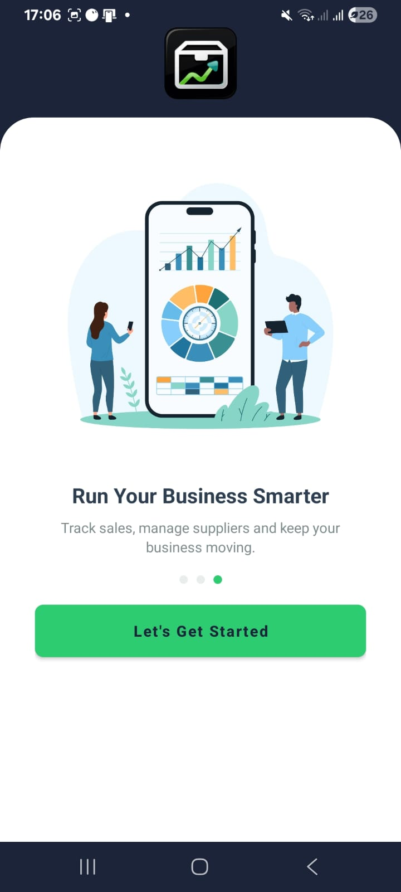 | 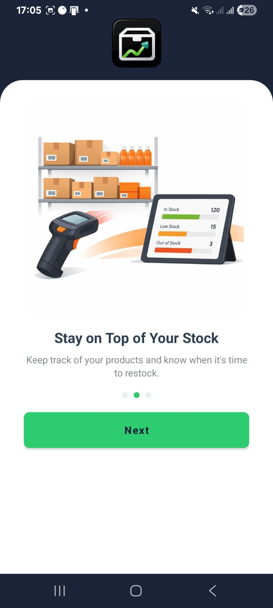 | 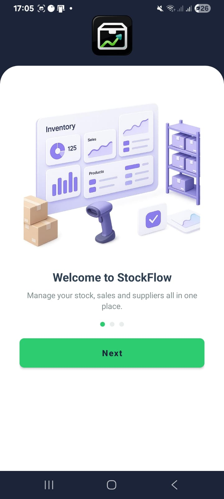 |

### Authentication

| Login | Register |
|---|---|
| 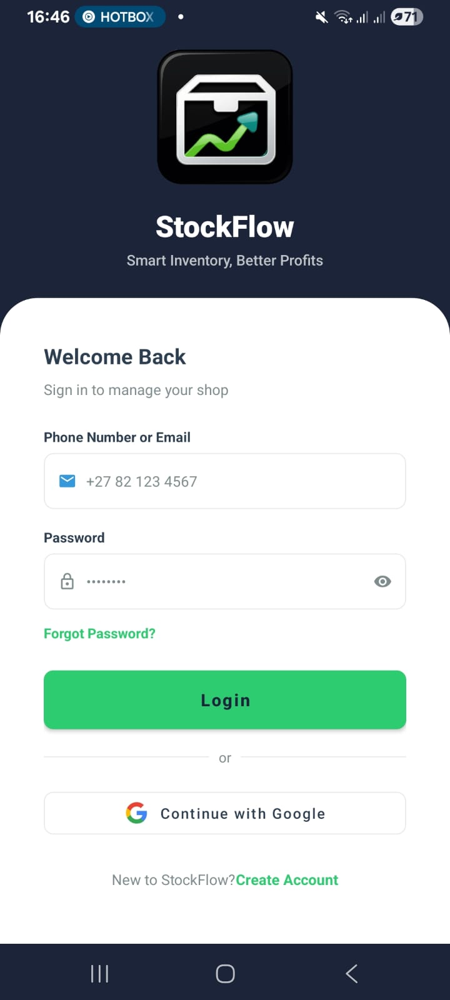 | 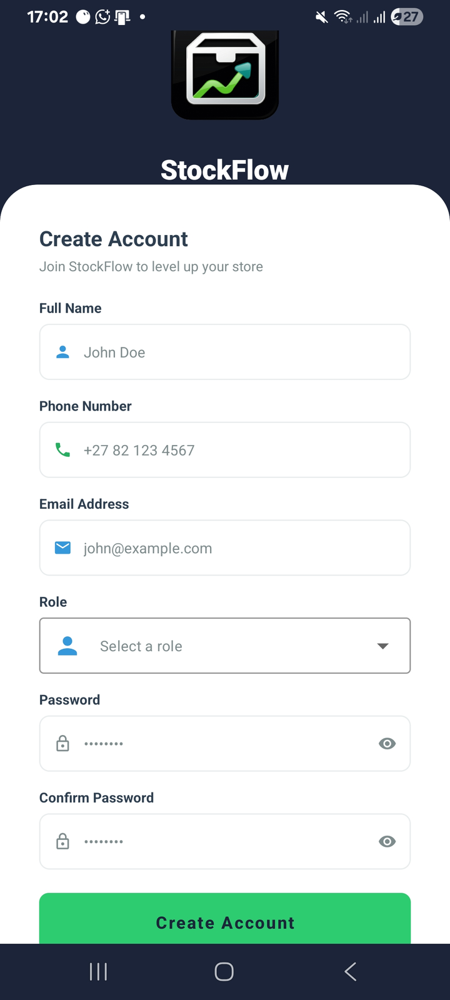 |

### Dashboard

| Dashboard |
|---|
| 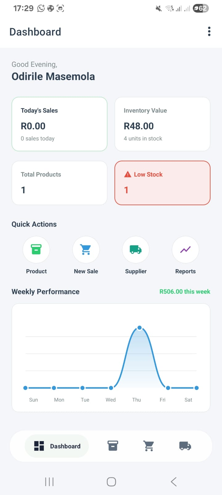 |

### Inventory

| Inventory | Add Product | Edit Product |
|---|---|---|
| 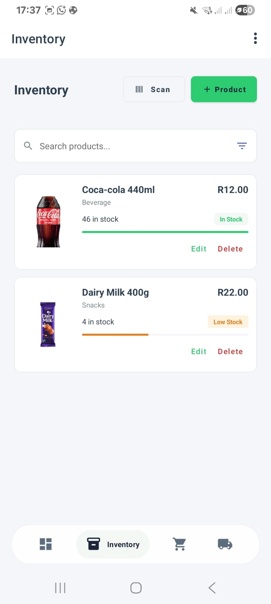 | 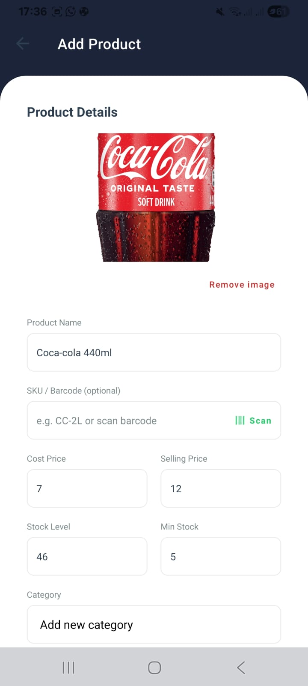 | 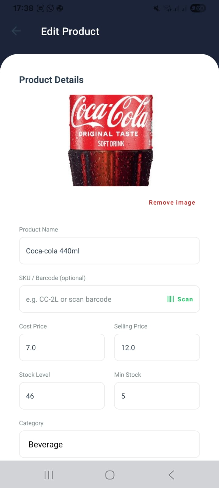 |

### Suppliers and Purchase Orders

| Suppliers | Purchase Orders | New Order |
|---|---|---|
| 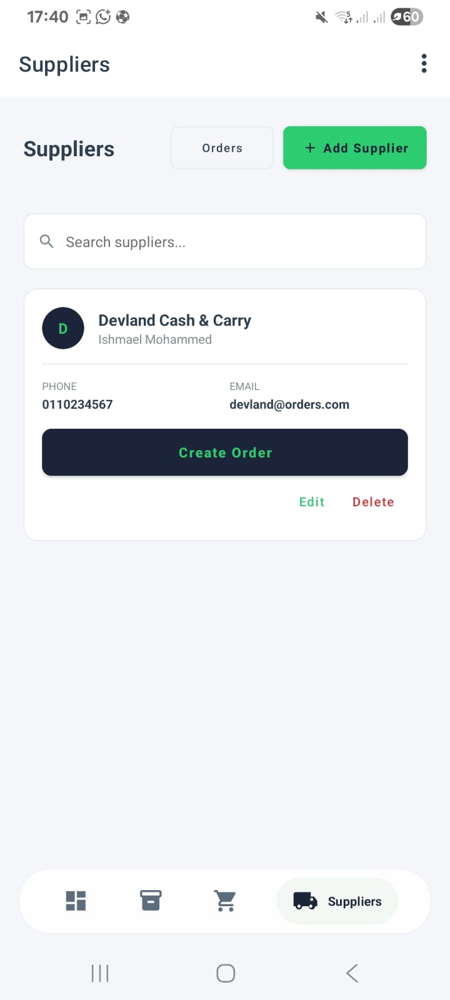 | 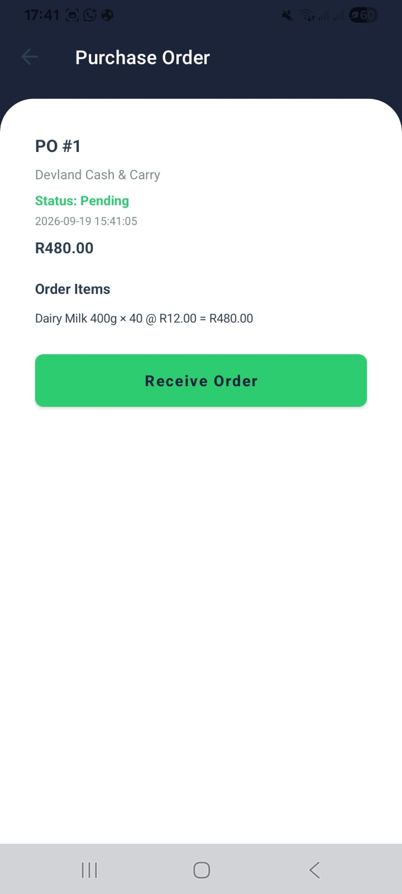 | 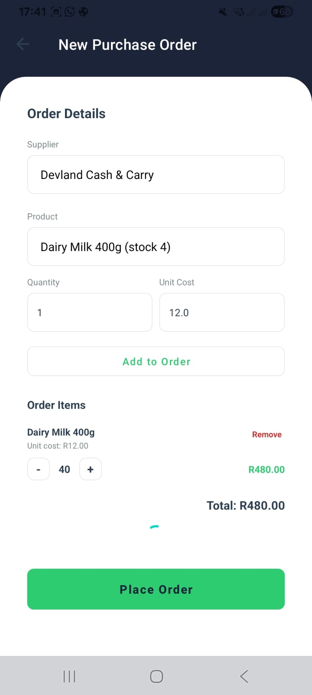 |

### Settings

| Settings |
|---|
| 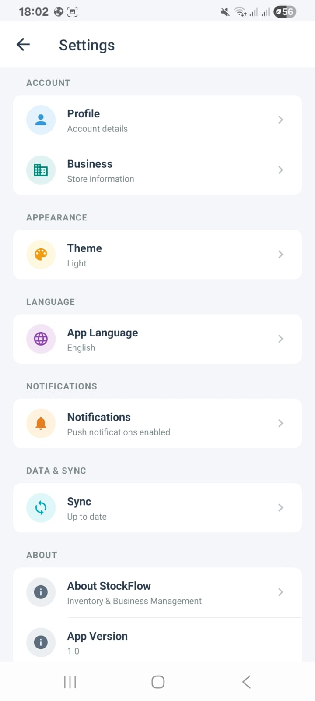 |

---

## System Architecture

```text
Android App
     ↓
Retrofit
     ↓
Ktor REST API
     ↓
PostgreSQL Database
```

<p align="center">
  
</p>

- Android handles the user interface.
- Ktor handles API requests and business logic.
- PostgreSQL stores application data.

---

## Database

The app uses PostgreSQL (hosted on Supabase) to store its data. Main tables:

- Users
- Roles
- Businesses
- Products
- Categories
- Suppliers
- Sales
- Sale Items
- Purchase Orders
- Purchase Order Items

---

## Authentication

- Email/password registration and login
- Passwords hashed with BCrypt
- JWT authentication for protected endpoints
- Google Sign-In

---

## Testing

GitHub Actions automatically builds and tests the project on every push:

- Backend: builds the Ktor module and packages the Shadow JAR
- Android: runs unit tests and assembles the debug APK

---

## Project Structure

```text
StockFlow/
├── app/       # Android application
├── backend/   # Ktor REST API
├── docs/      # Documentation and screenshots
└── gradle/    # Gradle configuration
```

---

## Getting Started

### Requirements
- Android Studio (Ladybug or newer)
- JDK 21
- PostgreSQL / Supabase account

### 1. Clone the repository

```bash
git clone https://github.com/OdirileMasemola/Stock-Flow.git
cd Stock-Flow
```

### 2. Backend setup

Create a `.env.local` file in the `backend` directory with:

```env
DB_URL=jdbc:postgresql://your-db-host:5432/postgres
DB_USER=your-user
DB_PASSWORD=your-password
JWT_SECRET=your-secure-secret
```

Run the backend:

```bash
./gradlew :backend:run
```

### 3. Android setup

1. Open the project in Android Studio.
2. Sync Gradle.
3. Run the `app` module on an emulator or physical device.

---

## Group Members

| Student Number | Name             |
| --------------- | ---------------- |
| S10104238       | Lerato Mokoena   |
| ST10441421      | Odirile Masemola |
| ST10450294      | Ripfumelo Mabasa |
| ST10168130      | Sisipho Njili    |

---

## License

This project is licensed under the **MIT License** — see the [LICENSE](LICENSE) file for details.
