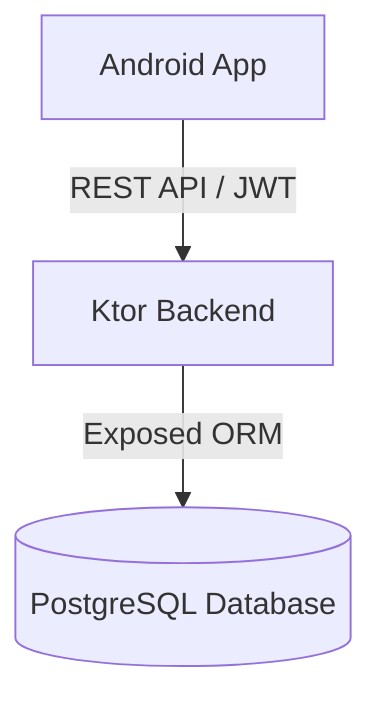

# StockFlow

StockFlow is a comprehensive full-stack inventory management and Point of Sale (POS) system designed for small businesses.

## Project Architecture

The system follows a modern full-stack architecture:

- **Android App**: A high-fidelity mobile application built with Kotlin and XML layouts.
- **Ktor REST API**: A modular backend service handling business logic, authentication, and data management.
- **PostgreSQL Database**: A robust relational database for persistent storage.

## Repository Structure

The project is organized as a monorepo for better separation of concerns while keeping everything in one place:

- **/android/StockFlowAndroid/**: The complete Android Studio project.
- **/backend/StockFlowBackend/**: The Ktor backend Gradle project.

## Project Status

- [x] High-fidelity Android UI implementation.
- [x] Fragment-based professional navigation.
- [x] PostgreSQL database integration.
- [x] Relational schema with 9 core tables.
- [x] Secure user registration with BCrypt.
- [x] Secure user login with JWT tokens.
- [x] JWT authentication middleware.

## Technical Stack

### Frontend (Android)
- Kotlin
- ViewBinding & MVVM Architecture
- Material Design (CoordinatorLayout, CollapsingToolbar)
- Retrofit (Planned)

### Backend (Ktor)
- Ktor 3.x (Netty)
- Exposed ORM (PostgreSQL)
- HikariCP Connection Pooling
- BCrypt & JWT Security
- kotlinx.serialization

## Getting Started

### Backend
1. Navigate to `backend/StockFlowBackend`.
2. Configure your `.env` file based on `.env.example`.
3. Run with `./gradlew run`.

### Android
1. Open the `android/StockFlowAndroid` folder in Android Studio.
2. Sync Gradle and build the project.
